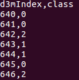
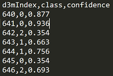
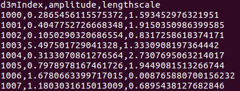

# Problem Schema (version 3.1.1)

Dataset schema provides a specification of an abstract data science problem. It is contained in the [problemSchema.json](../schemas/problemSchema.json) file. An instance of this schema is included with every problem in the problemDoc.json file. The semantics of problemSchema.json and problemDoc.json is [here](FAQ.md#semantics).  

Problem schema specifies a dataset in three sections: about, inputs, and expectedOutputs. Each of these sections are described below.

# About

The "about" section contains of some general information about the problem and consists of the following fields.

| Field                 | Description                                                                                       | 
|-----------------------|---------------------------------------------------------------------------------------------------| 
| problemID             | a unique ID assigned to a problem                                                                 | 
| problemName           | the name of a problem                                                                             | 
| problemURI            | the location of the problem                                                                       | 
| problemDescription    | a brief description of the problem                                                                | 
| taskType              | the type of the machine learning task                                                             | 
| taskSubType           | the sub-type of the task 										                                                      | 
| problemVersion        | the version of the current problem                                                                |
| problemSchemaVersion  | the version of the problem schema 																                                |

Currently, the task types can be one of the following:

| taskType | Example datasets |
|----------|-----------------------------|
| classification |                       |
| regression |                           |
| clustering |                           |
| linkPrediction |                       |
| vertexNomination |                     |
| communityDetection |                   |
| graphMatching |                        |
| timeSeriesForecasting |                |
| collaborativeFiltering |               |
| [objectDetection](#object-detection-task)|

Notes on task sub-types:

| taskSubType | Notes |
|----------|-----------------------------|
| binary | applicable for classification, vertexNomination |
| multiClass | applicable for classification, vertexNomination |
| multiLabel | applicable for classification |
| univariate | applicable for regression |
| multivariate | applicable for regression |
| overlapping | applicable for clustering, community detection |
| nonOverlapping | applicable for clustering, community detection |


# Inputs

This section specifies the three inputs that are required to understand and solve a problem in the context of D3M. They include: data, data splits, and performance metrics.
```
"inputs":{
  "data":[
	...
  ],
  "dataSplits":{
	...
  },
  "performanceMetrics":{
	...
  }
}
```

## Data

Data refers to the dataset(s) over which a problem is defined. A problem can refer to multiple datasets. That is captured by the datasetID field, which is a list.
```
"data":[
  {
    "datasetID":"sample_dataset_ID",
    ...
  }
]
```
<a name="target-index"></a>
In addition to the datasetID, one has to also specify target variable(s) on that dataset as part of the problem specification. Each target variable is specified by referring to a table using its "resID" and specifying its target column index and column name. For a correct specification, the target column names and indexes in problemDoc should match with the corresponding column names and indexes in datasetDoc. The redundancy of specifying a target by its column name and index is by design.
```
"data": [
  {
    "datasetID":"sample_dataset_ID"
    "targets":
    [
      {
        "targetIndex":0,
        "resID":"0",		// reference to a table in the dataset
        "colIndex":18,
        "colName":"classLabel"
      }
    ]
  }
]
```
For more information about "resID", "colIndex", and "colName", refer to the [datasetSchema.json](../schemas/datasetSchema.json)

"targets" also has an optional "numClusters" field. This field is applicable to clustering problems. It is used to specify the number of clusters to be generated by the solution algorithm (if this information is known apriori).

## Data Splits

Every problem has a special __dataSplits__ file. This file contains information about which rows in the learning data are 'TRAIN' rows and which ones are 'TEST' rows. It has the following columns: [d3mIndex, type, repeat, fold] as shown in the problem sample below.


For objectDetection tasks, we have a multi-index (d3mIndex, image). Therefore, dataSplits has the following columns: [d3mIndex, image, type, repeat, fold] as shown in the sample below.


This split file indirectly reflects the evaluation procedure that was used to define the problem. The "dataSplits" section in the problem schema contains information that can be used to infer the evaluation procedure and interpret the dataSplits file. It contains the following fields:

| Field | Description |
|-------|-------------|
| method | refers to the evaluation method reflected in the data splits. Currently, it can be one of "holdOut" or "kFold". Can be extended in future to accommodate others. It is always 'holdOut' by default |
| testSize | applicable to "holdOut" method, it specifies the size of the test split in the range 0.0 to 1.0. |
| numFolds | applicable to "kFold" method, it specifies the number of folds |
| stratified | specifies if the split is stratified or not, default value being True |
| numRepeats | specifies how many repeats, e.g., 3 repeats of 50% holdout |
| randomSeed | the random number generator seed that was used to generate the splits |
| splitsFile | the relative path to the splits file from the problem root, which is "dataSplits.csv" directly under the problem root by default|

## Performance metrics

Another important part of a problem specification is set of metrics that will be used to evaluate the performance of a solution. The "performanceMetrics" section of the problem schema is a **list** of metrics. The provided metrics are the following. This is not meant to be an exhaustive list and more metrics can be added as needed to provide coverage to the problems as they grow. It is also possible to specify a custom metric using "other" and specifyOther" fields.

| Metric | Notes |
|--------|-------|
| accuracy | sklearn.metrics.accuracy_score |
| precision | sklearn.metrics.precision_score |
| recall | sklearn.metrics.recall_score |
| f1 | sklearn.metrics.f1_score (pos_label=1) |
| f1Micro | sklearn.metrics.f1_score(average='micro') |
| f1Macro | sklearn.metrics.f1_score(average='macro') |
| rocAuc | sklearn.metrics.roc_auc_score |
| rocAucMicro | sklearn.metrics.roc_auc_score(average='micro') |
| rocAucMacro |  sklearn.metrics.roc_auc_score(average='macro') |
| meanSquaredError | sklearn.metrics.mean_squared_error |
| rootMeanSquaredError | sqrt(sklearn.metrics.mean_squared_error) |
| rootMeanSquaredErrorAvg | sum(root_mean_squared_error_list)/len(root_mean_squared_error_list) |
| meanAbsoluteError | sklearn.metrics.mean_absolute_error |
| rSquared | sklearn.metrics.r2_score |
| normalizedMutualInformation | sklearn.metrics.normalized_mutual_info_score |
| jaccardSimilarityScore | sklearn.metrics.jaccard_similarity_score |
| precisionAtTopK | see the code [below](#precision_at_top_K) |
| objectDetectionAP | see the code [below](#objectDetectionAP) |

<a name="precision_at_top_K"></a>
```
import numpy as np
def precision_at_top_K(gt, preds, K=20):
    """
    This function examines the first K entries of a
    ground truth vector (gt) and predicted labels (preds)
    and determines how many values are shared between them.
    The result is then scaled by K to get the accuracy at top K.  

    Parameters:
    -----------
    gt: 1d array-like
        Array of ground truth labels.

    preds: 1d array-like
        Array of predicted labels.

    K: int, 20 by default
        The number of samples to use when computing the accuracy.

    Returns:
    --------
    prec_at_top_K: float
        The number of labels shared between the ground truth and
        the predictions divided by K.


    Example:
        >>> gt = [0, 1, 2, 3, 4]
        >>> pred = [1, 3, 2, 4, 0]

        >>> precision_at_top_K(gt, pred, K=3)
        0.667

        >>> precision_at_top_K(gt, pred, K=4)
        0.75
    """

    gt = gt[0:K]
    preds = preds[0:K]
    prec_at_top_K = np.float(len(np.intersect1d(gt, preds))) / K
    return prec_at_top_K
```


<a name="objectDetectionAP"></a>
```
def objectDetectionAP(dets, gts, ovthresh=0.5, use_07_metric=False):
    """
    This function takes a list of ground truth boxes and a list of detected bounding boxes
    for a given class and computes the average precision of the detections with respect to
    the ground truth boxes.

    Parameters:
    -----------
    dets: list
     List of bounding box detections. Each box is represented as a list
     with format:
         Case 1 (confidence provided):
             ['image_name', 'x_min', 'y_min', 'x_max', 'y_max', 'confidence']
         Case 2 (confidence not provided):
             ['image_name', 'x_min', 'y_min', 'x_max', 'y_max']

    gts: list
     List of ground truth boxes. Each box is represented as a list with the
     following format: [image_name, x_min, y_min, x_max, y_max].

    [ovthresh]: float
     Overlap threshold (default = 0.5)

    [use_07_metric]: boolean
     Whether to use VOC07's 11 point AP computation (default False)

    Returns:
    --------
    rec: 1d array-like
     Array where each element (rec[i]) is the recall when considering i+1 detections

    prec: 1d array-like
     Array where each element (rec[i]) is the precision when considering i+1 detections

    ap: float
     Average precision between detected boxes and the ground truth boxes.
     (it is also the area under the precision-recall curve).

    Example:

    With confidence scores:
    >> predictions_list = [['img_00285.png',330,463,387,505,0.0739],
                           ['img_00285.png',420,433,451,498,0.0910],
                           ['img_00285.png',328,465,403,540,0.1008],
                           ['img_00285.png',480,477,508,522,0.1012],
                           ['img_00285.png',357,460,417,537,0.1058],
                           ['img_00285.png',356,456,391,521,0.0843],
                           ['img_00225.png',345,460,415,547,0.0539],
                           ['img_00225.png',381,362,455,513,0.0542],
                           ['img_00225.png',382,366,416,422,0.0559],
                           ['img_00225.png',730,463,763,583,0.0588]]
    >> ground_truth_list = [['img_00285.png',480,457,515,529],
                            ['img_00285.png',480,457,515,529],
                            ['img_00225.png',522,540,576,660],
                            ['img_00225.png',739,460,768,545]]

    >> rec, prec, ap = objectDetectionAP(predictions_list, ground_truth_list)
    >> print(ap)
    0.125

    Without confidence scores:
    >> predictions_list = [['img_00285.png',330,463,387,505],
                           ['img_00285.png',420,433,451,498],
                           ['img_00285.png',328,465,403,540],
                           ['img_00285.png',480,477,508,522],
                           ['img_00285.png',357,460,417,537],
                           ['img_00285.png',356,456,391,521],
                           ['img_00225.png',345,460,415,547],
                           ['img_00225.png',381,362,455,513],
                           ['img_00225.png',382,366,416,422],
                           ['img_00225.png',730,463,763,583]]
    >> ground_truth_list = [['img_00285.png',480,457,515,529],
                            ['img_00285.png',480,457,515,529],
                            ['img_00225.png',522,540,576,660],
                            ['img_00225.png',739,460,768,545]]

    >> rec, prec, ap = objectDetectionAP(predictions_list, ground_truth_list)
    >> print(ap)
    0.0625

    """
    
```
For the complete code, see this [file](./code/d3m_eval.py). 

**Note**: There can be multiple performance metrics included for a single problem. For example:
```
"performanceMetrics": [
      {
        "metric": "accuracy"
      },
      {
        "metric": "f1"
      }
    ]
```
### Optional parameters for metrics
Notice that there are optionsl metric parameters in the problemSchema:
```
...
    "applicabilityToTarget":{"type":"string","required":false,"allowed":["singleTarget", "allTargets"], "default":"singleTarget"},
    "K":{"type":"integer","required":false,"dependencies": {"metric":"precisionAtTopK"}},
    "posLabel":{"type":"string","required":false, "dependencies": {"metric":"f1"}}
...
```

| parameter             | Notes                                                                                                 |
|-----------------------|-------------------------------------------------------------------------------------------------------|
| K                     | This is applicable to the metric 'precisionAtTopK' and provided the value of K                        |
| posLabel              | This is applicable to the metric 'f1' and indicates which class should be treated as "positive" class |
| applicabilityToTarget | singleTarget: applies to each target; allTargets: applies to the set of all the target predictions    |

# Expected outputs

The "expectedOutputs" in the problem schema directs the solution systems to produce output(s) in a standardized manner. 
```
"expectedOutputs":{"type":"dict","required":true,"schema":{
  "predictionsFile": {"type":"string", "required":true, "default":"predictions.csv"},
  "scoresFile": {"type":"string", "required":false, "default":"scores.csv"}
}}
```
## Predictions file

Currently, there is only one required output, which is the predictions file - all solution systems should output this file. By default the name of this file is "predictions.csv", but can be changed in a problem instance using the "predictionsFile" field in the problem schema. The predictions file is essentially [d3mIndex + predicted target column(s) + (optional) confidence]. The target columns contain the predicted values as shown in the sample below:

| predictions.csv |
|-----------------|
|  |

Predictions file can also have an optional confidence column as shown below. 'Confidence' (case insensitive) is a reserved keyword in the context of predictions.csv.

| predictions.csv (with Confidence) |
|-----------------------------------|
| |

Confidence column can come into play when computing certain evaluation metrics. An example of how the confidence columns is used in scoring for objectDetection task is shown in example [below](#object-detection-scoring). 


__Notes__
- A target column is represented in the predictions file by its **colName**, which is specified in problemDoc.json under **inputs**->**data**->**targets**.
- We are interested in predictions for 'TEST' data points only.
- Multiple targets can be handled seamlessly by adding multiple target columns as shown in the sample below:



## Scores file

A scores file can be another output from a solution pipeline when the ground truth for test data is known. Hence, this output is optional. Problem schema already specifies the given metrics under "performanceMetrics" under "inputs" section. The default scores.csv file will contain the following columns: [index, problemID, metric, value]. 

The baselines systems produced by MIT-LL will produce both predictions file and scores file.

# Appendix
<a name="object-detection-task"></a>
## Object Detection Task 
The typical structure of an objectDetection task is as follows:
```
LL1_some_object_detection_task /
  |-- LL1_some_object_detection_task_dataset /
    |-- tables /
        |-- learningData.csv
        |--
    |-- media /
        |-- img01.jpg
        |-- img02.jpg
        |-- img03.jpg
        |-- img04.jpg
        ...
    |-- datasetDoc.json
  |-- LL1_some_object_detection_task_problem /
      |-- problemDoc.json
      |-- dataSplits.csv
  |-- LL1_some_object_detection_task_solution /
      |-- src /
      |-- predictions.csv
      |-- scores.csv

```

The learningData.csv for this problem might look like the following:

| d3mIndex  | image  | someOtherCol1 | someOtherCol2 | ... |bounding_box|
|-----------|--------|---------------|---------------|-----|------------|
|0|img01.jpg|someVal|someVal|...|"10,11,100,100"|
|1|img01.jpg|someVal|someVal|...|"21,22,98,64"|
|2|img01.jpg|someVal|someVal|...|"33,36,37,200"|
|...|...|...|...|...|...|...|...|...|
|11|img03.jpg|someVal|someVal|...|"6,13,131,54"|
|12|img03.jpg|someVal|someVal|...|"17,29,22,159"|
|...|...|...|...|...|...|...|...|...|

- For this type of the datasets, as seen above, the target column is a bounding box, whose type is a vector of reals is represented as a string of 4 comma-separated values, containing 4 values of "x_min,y_min,x_max,y_max"
- We will follow this standard convention: (x_min, y_min) is top left; (x_max, y_max) is bottom right

The relevant parts of the datasetDoc.json for this problem will look like the following:
```
...

  "dataResources": [
    {
      "resID": "0",
      "resPath": "media/",
      "resType": "image",
      "resFormat": [
        "image/png"
      ],
      "isCollection": true
    },
    {
      "resID": "1",
      "resPath": "tables/learningData.csv",
      "resType": "table",
      "resFormat": [
        "text/csv"
      ],
      "isCollection": false,
      "columns": [
        {
          "colIndex": 0,
          "colName": "d3mIndex",
          "colType": "integer",
          "role": [
            "index"
          ]
        },
        {
          "colIndex": 1,
          "colName": "image",
          "colType": "string",
          "role": [
            "index"
          ],
          "refersTo": {
            "resID": "0",
            "resObject": "item"
          }
        },
        {
          "colIndex": 2,
          "colName": "bounding_box",
          "colType": "realVector",
          "role": [
            "suggestedTarget",
            "boundaryIndicator",
            "boundingBox"
          ],
          "refersTo": {
            "resID": "1",
            "resObject": {
              "columnName": "image"
            }
          }
        }
      ]
    }
...
```

- One notable differene in learningData.csv in this case is that it has a multiIndex consisting of 'd3mIndex' (role=index) and 'image' (refers to a an image file and role=index). The reason we also index using the image file is because the number of bounding boxes predicted by the model can be higher or lower than the number of bounding boxes in the ground truth. Therefore, the d3mIndex values in the predictions.csv and targets.csv (ground truth) do not align. Therefore, the images are used to align the two. Therefore, the predictions.csv file should also contain the image column in addition to the d3mIndex column. Look at the example below where this is illustrated.
- Another notable difference in this type of problem is the nature of the target column. Since the targets are are bounding boxes, this column specified through the roles: 'suggestedTarget' and 'boundaryIndicator' and 'boundingBox. 
- Further, the target column of bounding boxes references the image column to establish the relationship between the images and their bounding boxes.


<a name="object-detection-scoring"></a>
### Computing the performance score in objectDetection tasks 
#### Case 1: Predictions with confidence scores
| predictions.csv | targets.csv (ground truth) |
|-----------------|----------------------------|
|| |

### Note: 

The values of d3mIndex may not align across predictions.csv and targets.csv. This is because the ground truth may have X number of bounding boxes and the model might predict Y number of boxes and X may not be equal to Y. Therefore, including image column becomes important. The objectDetectionAP scoring function ignores the d3mIndex column and uses the images to align the predicitons and ground truth.

The above predictions and ground truth are evaluated by the [objectDetectionAP](#objectDetectionAP) function as follows:
```
predicitons_list = [['img_00285.png',330,463,387,505,0.0739],
                    ['img_00285.png',420,433,451,498,0.0910],
                    ['img_00285.png',328,465,403,540,0.1008],
                    ['img_00285.png',480,477,508,522,0.1012],
                    ['img_00285.png',357,460,417,537,0.1058],
                    ['img_00285.png',356,456,391,521,0.0843],
                    ['img_00225.png',345,460,415,547,0.0539],
                    ['img_00225.png',381,362,455,513,0.0542],
                    ['img_00225.png',382,366,416,422,0.0559],
                    ['img_00225.png',730,463,763,583,0.0588]]
ground_truth_list = [['img_00285.png',480,457,515,529],
                      ['img_00285.png',480,457,515,529],
                      ['img_00225.png',522,540,576,660],
                      ['img_00225.png',739,460,768,545]]

score = objectDetectionAP(predicitons_list, ground_truth_list)
print(score)

>> 0.125
```

#### Case 2: Predictions without confidence scores
Assuming that the confidence scores were not included in the above example, the score is computed assuming a uniform confidence distribution as shown below:
```
predicitons_list = [['img_00285.png',330,463,387,505],
                    ['img_00285.png',420,433,451,498],
                    ['img_00285.png',328,465,403,540],
                    ['img_00285.png',480,477,508,522],
                    ['img_00285.png',357,460,417,537],
                    ['img_00285.png',356,456,391,521],
                    ['img_00225.png',345,460,415,547],
                    ['img_00225.png',381,362,455,513],
                    ['img_00225.png',382,366,416,422],
                    ['img_00225.png',730,463,763,583]]
ground_truth_list = [['img_00285.png',480,457,515,529],
                      ['img_00285.png',480,457,515,529],
                      ['img_00225.png',522,540,576,660],
                      ['img_00225.png',739,460,768,545]]

score = objectDetectionAP(predicitons_list, ground_truth_list)
print(score)

>> 0.0625
```

#### Important notes about the objectDetection task
1. In this task, the image is also used as an index (in addition to d3mIndex) in learningData.csv
2. In this task, the targets are bounding boxes consisting of 1 column represented as "x_min,y_min,x_max,y_max" (their roles are 'suggestedTarget', 'boundaryIndicator', and 'boundingBox')
3. In this task, predictions.csv contains two index columns d3mIndex and images.
4. In this task, predictions.csv contains an optional confidence column.
